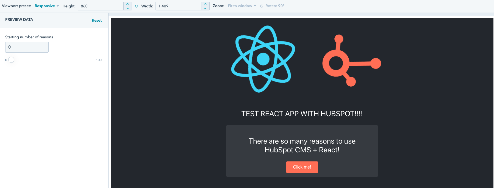

# cms-react-boilerplate [beta]

Boilerplate [React](https://reactjs.org/) project for creating apps using modules on the HubSpot CMS

## Getting Started

For more information on local development tools, see [Local Development Tooling: Getting Started](https://designers.hubspot.com/docs/tools/local-development)

### Configuration

#### Set up HubSpot CMS CLI ([`@hubspot/cli`](https://www.npmjs.com/package/@hubspot/cli))

- A config file named `hubspot.config.yml` will also be needed. The config can be at the project level or higher up in the directory tree.
- Be sure to set a `defaultPortal` in your `hubspot.config.yml` to which you'd like the built app files to sync.
- Do not upload the folder into HubSpot.

### Node Version

- Installing version 16.

### Install

- Run `npm install` or `yarn install` to install needed dependencies.

### Running

- Run `npm start` or `yarn start` to automatically upload your project to `defaultPortal`.
- Create a page from default theme, or any drag-and-drop (`dnd_area`) enabled template in your portal, and add the `app (label: React app boilerplate)` module.

### package.json scripts

- `start` : Builds project with webpack, uploads to your `defaultPortal` specified in `hubspot.config.yml` and watches for changes via [`@hubspot/webpack-cms-plugins/HubSpotAutoUploadPlugin`](https://www.npmjs.com/package/@hubspot/webpack-cms-plugins).
- `build` : Clears `/dist` contents and builds project into `/dist`.
- `deploy` : Clears `/dist` contents, builds project into `/dist`, and uploads to via [`@hubspot/cli`](https://www.npmjs.com/package/@hubspot/cli).
- `lint` : Lints CSS, JS, and JSON files via `eslint` ([documentation](https://eslint.org/docs/user-guide/configuring)) and checks for formatting via `prettier`([documentation](https://prettier.io/docs/en/configuration.html)) in `src`.
  - For configs, see `prettier.config.js` and `eslintrc.js`.
- `prettier:write` : Formats JS and JSON files in `src`.
  - For configs, see `prettier.config.js`.

### Preview in HubSpot

- In `App.js` click a Preview button 
